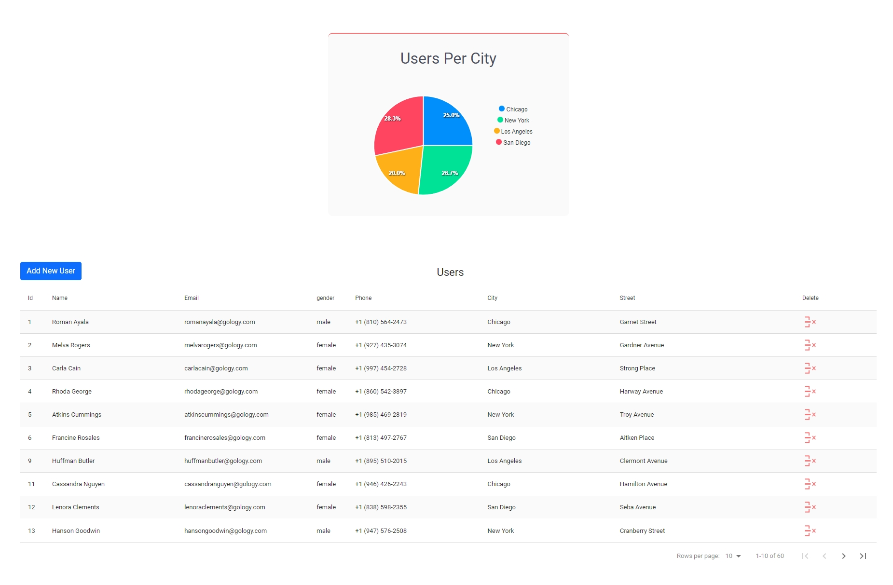

# callapp

 
 This app was created as Technical Task for callapp. Task was to display / modify  JSON data as a table and Piechart using specific tools.   

 
 <h3> Live Preview :  https://callapp-levani-kantaria.web.app </h3>   # Note that first time loading might take some time ( 10-15 sec) because server is sleeping during inactivity.

<ul> <h2> Tools Used : </h2> 

 <li> koa </li>
  <li> React / Typescript </li>
  <li> Zsutand </li>
  <li> React Data Table Component  </li>
  <li> ApexCharts  </li>
  <li> reactstrap  </li>
  <li> styled-components  </li>
  <li> antd  </li>

</ul>

